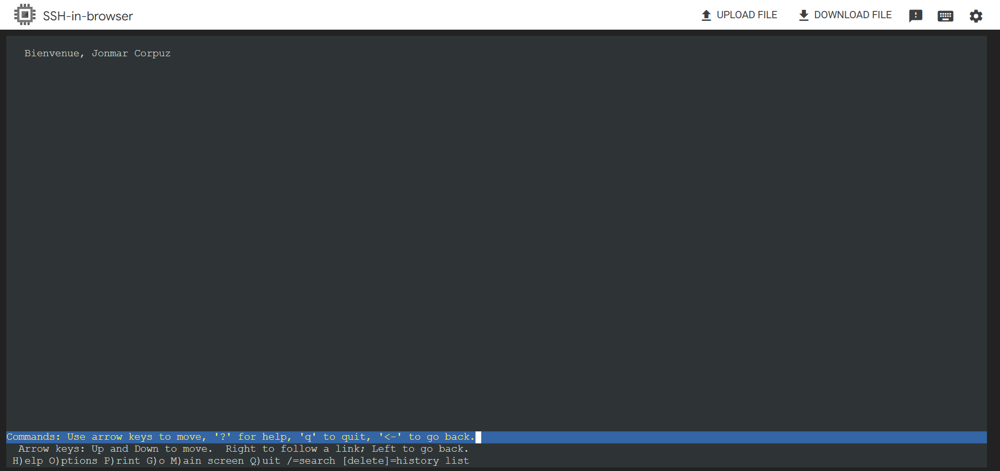

# Tache 1

1. Créer un Dockerfile dans `~/TP1-1`
```Bash
# Créer le répertoire TP1-1
mkdir Tp1-1
cd Tp1-1

# Créer le Dockerfile
touch Dockerfile
```

2. Écrire le contenu du Dockerfile
```Bash
# Utiliser l'image Ubuntu la plus récente comme base pour l'image Docker
FROM ubuntu:latest

# Mettre à jour les paquets et installer les applications demandées (Nginx, Vim, Lynx et Gimp)
RUN apt-get update && apt-get install -y \
    nginx \
    vim \
    lynx \
    gimp

# Ajouter une page web simple avec mon nom et prénom
RUN echo "Bienvenue, Jonmar Corpuz" > /var/www/html/index.html

# Exposer le port 80 pour le trafic HTTP
EXPOSE 80

# Lancer Nginx en arrière-plan
CMD ["nginx", "-g", "daemon off;"]
```

3. Construire l’image Docker
```Bash
docker build -t ubuntu:jonmar . 
```

4. Créer le conteneur
```Bash
docker run -d -p 80:80 ubuntu:jonmar
```

5. Trouver l'addresse IP du conteneur
```Bash
docker inspect -f '{{range .NetworkSettings.Networks}}{{.IPAddress}}{{end}}' CONTAINER_ID
```

6. Capturer l’image de votre conteneur avec la commande `lynx @IP_votre_index`



# Tache 2
1. Créer un Dockerfile dans `~/TP1-1`
```Bash
# Créer le répertoire TP1-1
mkdir Tp1-2
cd Tp1-2

# Créer le Dockerfile
touch Dockerfile
```

2. Écrire le contenu du Dockerfile
```Bash
# Utiliser l'image CentOS la plus récente comme base pour l'image Docker
FROM centos:latest

# Corriger les dépôts pour utiliser vault.centos.org
RUN sed -i s/mirror.centos.org/vault.centos.org/g /etc/yum.repos.d/CentOS-*.repo && \
    sed -i s/^#.*baseurl=http/baseurl=http/g /etc/yum.repos.d/CentOS-*.repo && \
    sed -i s/^mirrorlist=http/#mirrorlist=http/g /etc/yum.repos.d/CentOS-*.repo

# Mettre à jour les paquets et installer httpd et net-tools
RUN yum update -y && yum -y install httpd net-tools

# Créer un index.html simple pour tester le serveur
RUN echo "<html><body><h1>Bienvenue sur le serveur CentOS!</h1></body></html>" > /var/www/html/index.html

# Assurer les bonnes permissions pour le répertoire web
RUN chmod -R 755 /var/www/html && chown -R apache:apache /var/www/html

# Ouvrir le port 80 pour le serveur web
EXPOSE 80

# Démarrer le serveur Apache en mode foreground pour garder le conteneur actif
CMD ["/usr/sbin/httpd", "-D", "FOREGROUND"]
```

3. Construire l’image Docker
```Bash
docker build -t centos:jonmar . 
```

4. Créer le conteneur
```Bash
docker run -d -p 80:80 centos:jonmar
```

5. Trouver l'addresse IP du conteneur
```Bash
docker inspect -f '{{range .NetworkSettings.Networks}}{{.IPAddress}}{{end}}' CONTAINER_ID
```

6. Capturer l’image de votre conteneur avec la commande `lynx @IP_votre_index`


# Tache 3

1. Créer un fichier Docker Compose
```Bash
# Créer un fichier Docker Compose
touch docker-compose.yaml
```

2. Écrire le contenu du YAML file
```YAML
version: '3.8'
services:
  mysql:
    image: mysql:latest
    environment:
      MYSQL_ROOT_PASSWORD: rootpassword
      MYSQL_DATABASE: mydatabase
      MYSQL_USER: user
      MYSQL_PASSWORD: password
    volumes:
      - mysql-data:/var/lib/mysql
    networks:
      mynetwork:
        ipv4_address: 172.20.0.2
    deploy:
      resources:
        limits:
          cpus: '0.25'
          memory: 400M

  nginx:
    build: 
      context: ./tp1-1 
    ports:
      - "5000:80"
    volumes:
      - ./nginx_data:/var/www/html  
    networks:
      mynetwork:
        ipv4_address: 172.20.0.3
    deploy:
      resources:
        limits:
          cpus: '0.25'
          memory: 400M

  jenkins:
    image: jenkins/jenkins:lts
    ports:
      - "9005:8080"
    networks:
      mynetwork:
        ipv4_address: 172.20.0.4
    deploy:
      resources:
        limits:
          cpus: '0.25'
          memory: 1G

  sonarqube:
    image: sonarqube
    ports:
      - "9006:9000"
    networks:
      mynetwork:
        ipv4_address: 172.20.0.5
    deploy:
      resources:
        limits:
          cpus: '0.25'
          memory: 1G

volumes:
  mysql-data:
  nginx-data:

networks:
  mynetwork:
    driver: bridge
    ipam:
      config:
        - subnet: 172.20.0.0/24
```

3. Déployer les services avec Docker Compose
```Bash
sudo docker-compose up -d
```

4. Vérifier que les conteneurs sont en cours d'exécution et faire un test ping 
```Bash
sudo docker ps

sudo docker exec- it NGINX_DOCKER_ID ping -c 4 IP_ADDRESS
```

# Tache 4

1. Créez un Dockerfile pour notre serveur DHCP
```Bash
# Utilise une image alpine comme base
FROM ubuntu:latest

# Installez le serveur DHCP et autres dépendances nécessaires
RUN apt add --no-cache dhcp

# Créer le fichier de leases pour DHCP
RUN mkdir -p /var/lib/dhcp && touch /var/lib/dhcp/dhcpd.leases

# Copie de la configuration dhcpd.conf
COPY dhcpd.conf /etc/dhcp/dhcpd.conf

# Commande à exécuter pour lancer dhcpd
CMD ["/usr/sbin/dhcpd", "-4", "-f", "-d", "--no-pid", "-cf", "/etc/dhcp/dhcpd.conf"]

# Expose le port UDP 67 pour le serveur DHCP
EXPOSE 67/udp
```

# Tache 5

1. Déposer les fichiers Dockerfile dans notre git
```Bash
git push origin main
```